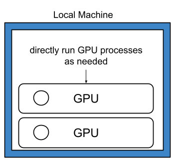
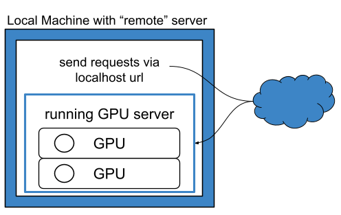
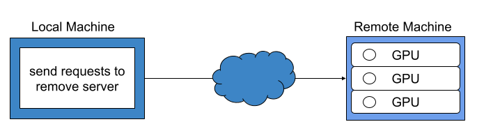

# Choosing an Inference Setup

LLM-backed steps in `matchminer-ai` can run in three setups. Pick based on
where your GPUs are and whether you want a persistent server:

| Package mode | Setup                         | Use when                                                        |
| ------------ | ------------------------------ | ----------------------------------------------------------------- |
| Local        | Run the model directly         | You have local GPUs and want the simplest setup                  |
| Remote       | Connect to a local vLLM server | You have local GPUs but want to run a persistent, reusable VLLM server on them to be used by MatchMiner-AI        |
| Remote       | Connect to another endpoint    | The model is hosted elsewhere (another machine, cluster, service) |

The two remote setups configure identically — you provide an endpoint URL
either way. The only difference is where that endpoint lives. Local mode is
the odd one out: no URL, no server process, nothing to manage.

While local mode is easiest to implement, there can be efficiency gains when using remote mode on a local vLLM server. Please see [Remote Package Mode](#remote-package-mode) for more information.

## Local Package Mode

### Run the Model Directly

`matchminer-ai` loads and runs the model in-process, using its built-in vLLM
backend — no separate server to start or manage. This is the simplest option
when the machine running `matchminer-ai` has enough GPU memory.

The model unloads when the workflow process ends, so this fits one-off runs
and testing better than long-running deployments.

Model and vLLM settings are provided through the package
[configuration](../reference/configuration.md).

## Remote Package Mode

Both setups below use remote mode: `matchminer-ai` talks to the model over an
OpenAI-compatible API instead of loading it in-process — even when the model
is running on the same machine.

### Connect to a Local vLLM Server

Run the model in a separate vLLM server process on the same machine, and
point `matchminer-ai` at it. This keeps the model loaded and reusable across
multiple calls or workflows, rather than reloading it each run.

It can also be faster for larger batches: the remote backend sends bounded
concurrent requests and can distribute work across configured server URLs.
Actual gains depend on the model, hardware, vLLM server settings, prompt
sizes, and configured concurrency.

`matchminer-ai` provides the
[`start_vllm_servers()`](../api/llm.md) helper to start one local
OpenAI-compatible vLLM server for each endpoint URL in the package
[configuration](../reference/configuration.md). With the default
configuration, this starts one server at a `localhost` URL.

### Connect to Another Endpoint

Point `matchminer-ai` at a model hosted elsewhere — another machine, a
compute cluster, or an approved service with an OpenAI-compatible chat
completions API.

The model host manages GPU resources and the inference server; you only
configure the [endpoint URL](../reference/configuration.md). It doesn't have
to be a vLLM server.

Remote mode expects the endpoint to return the final answer text in
`message.content`. The default tested setup is a vLLM server with a compatible
reasoning parser, which separates reasoning text from final answer text. Other
OpenAI-compatible endpoints may work only if they return final answer text in
`message.content`; endpoints that include reasoning text in `message.content`
are not currently supported.

!!! warning
    Before sending clinical text to an endpoint outside your local environment,
    confirm that the endpoint is approved for your data and institution.

