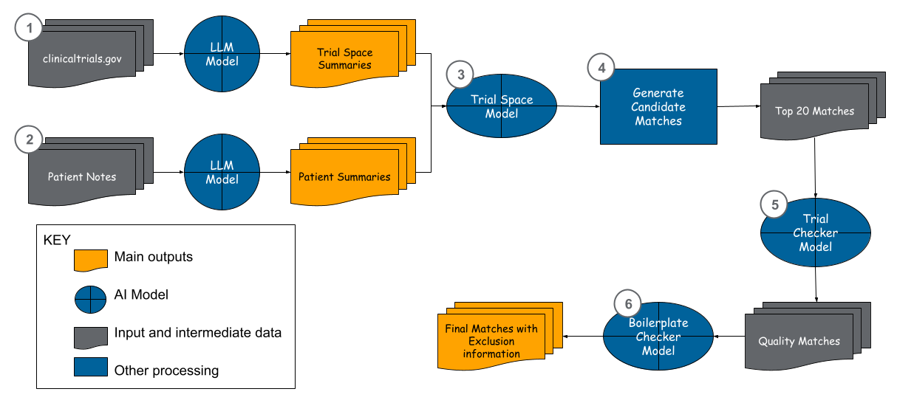

# MatchMiner-AI Tutorial

This tutorial provides background as well as specific information regarding how to run the `run_examples.ipynb` notebook.

There are two main ways patients and clinical trials can be matched:
1. Patient-centric matching: Find a set of clinical trials for a patient; and
2. Trial-centric matching: Find a set of patients for a clinical trial.

Currently, MatchMiner-AI is most fully developed for Patient-centric matching. The `run_examples.ipynb` notebook and the following information mainly support this method of finding patient-trial matches.

## How MatchMiner-AI works

MatchMiner-AI has 6 main steps (Figure 1):
1. Summarize Trials (Create a list of target populations, or trial 'spaces', for each trial, and extract the trial's "boilerplate" exclusion criteria)
2. Summarize Patients
3. Embed Trial Spaces[^1] and Patient Summaries (TrialSpace Model)
4. Generate Candidate Matches
5. Evaluate Candidate Match Quality (TrialChecker Model)
6. Check for Common Exclusion criteria unrelated to the core clinical question asked by the trial (Boilerplate Checker Model)

[^1] A processed clinical trial is divided into one or more Trial Spaces. Please see the [Trial Spaces](#trial-spaces) section below for more information.

Table 1 summarizes the models used for each step. For more on local and remote
inference options for LLM-backed steps, see
[Choosing an Inference Setup](local-vs-remote.md).

Table 1: MatchMiner-AI Steps and Models

| Step | Package Function | Model | Notes |
|------|-------|-------|--------|
| 1. Summarize Trials | `summarize_trials` | public LLM | by default, currently uses `google/gemma-4-31B-it` |
| 2. Summarize Patients | `summarize_patients` | public LLM | by default, currently uses `google/gemma-4-31B-it` |
| 3. Embed Trial Spaces and Patient Summaries | `embed_for_matching` | `TrialSpace`, a trained Sentence Transformers model | provided on Hugging Face at `https://huggingface.co/ksg-dfci` |
| 4. Generate Candidate Matches | `generate_candidate_matches` | NA | |
| 5. Evaluate Candidate Match Quality | `score_match_quality` | `TrialChecker`, a trained ModernBERT model [^2] | provided on Hugging Face at `https://huggingface.co/ksg-dfci` |
| 6. Check for Exclusions | `exclusion_criteria_check` | `BoilerplateChecker`, a trained ModernBERT model [^2] | provided on Hugging Face at `https://huggingface.co/ksg-dfci` |

[^2] for both score_match_quality and exclusion_criteria_check, we also offer alternative functions which perform these steps using a LLM. To run these steps with a LLM, use `score_match_quality_wth_LLM` and `exclusion_criteria_check_with_LLM`.

## Trial Spaces

A clinical trial may target one or more populations of patients with cancer. For each trial, MatchMiner-AI will extract a list of clinical “spaces” for the trial from its eligibility criteria, where each space is defined as a unique combination of core clinical concepts (age, sex, cancer type, histology, burden of disease, prior treatment, and biomarkers) that might render the patient eligible. Some trials have only one “space,” whereas others, such as basket or umbrella trials, have several. This concept may sometimes align with "cohorts" or "arms" described in trial documents, but it does not always do so. For example, a randomized controlled trial may be for only one clinical "space" or target population, but it may have two "arms", one of which is the experimental treatment, and one of which is the control treatment. At the end of `summarize_trials`, each trial space is listed as a separate entity or cohort in the dataframe.
